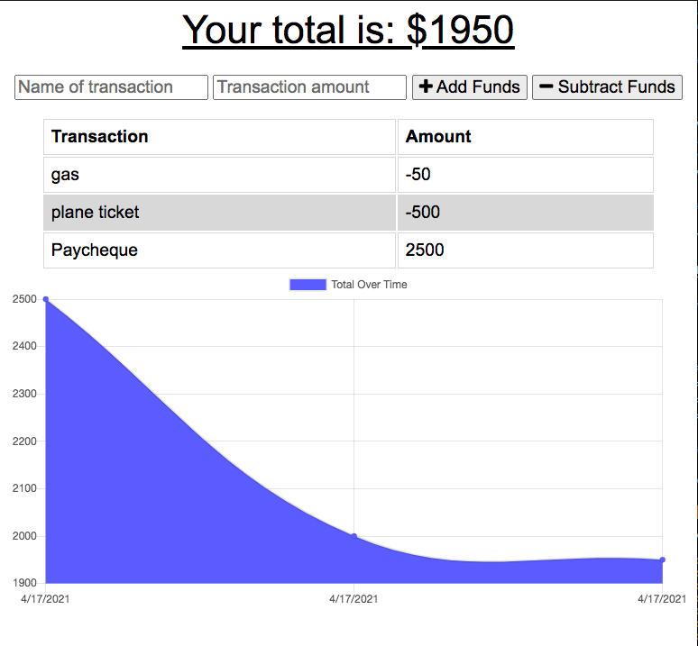
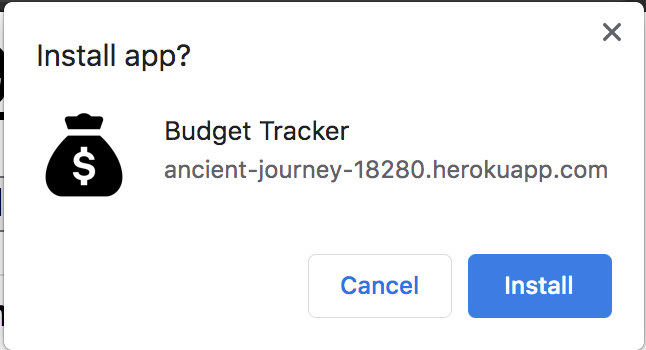

# Social-Network-API

## Table of Contents

1. [Description](#description)
2. [License](#license)
3. [Dependencies](#dependencies)
4. [Screenshots](#screenshots)
5. [Deployed-Url](#deployed-Url)
6. [Questions](#questions)

### Description

`AS AN avid traveler
I WANT to be able to track my withdrawals and deposits with or without a data/internet connection
SO THAT my account balance is accurate when I am traveling.`

Whether connected or not to the internet, this application will allow the user to:

* Enter deposit transactions
* Enter withdrawal transactions
* Download the application directly to device
* Post any transactions submitted while offline when reconnected to the internet.

### License

This application is covered under the [MIT](https://opensource.org/licenses/MIT) license.

### Dependencies

`Install: "npm i" in termninal` 

* "compression": "1.7.4"
* "express": "4.17.1"
* "mongoose": "5.5.15"
* "morgan": "1.9.1"

### Screenshots

`Landing page:`

How to download application:

`1. Click the download icon in the search bar.`

`2. Click install, app will launch on download completion.`

`Walkthrough of install:`

### Deployed-Url

[Click to visit deployed application!](https://ancient-journey-18280.herokuapp.com/)

`https://ancient-journey-18280.herokuapp.com/`

### Questions

Github Username: **Rajendra-Dhanraj**

[Click to follow and view my Github profile!](https://github.com/Rajendra-Dhanraj)

Alternatively, I can be contacted via email: **Rajendra.Dhanraj@gmail.com**
